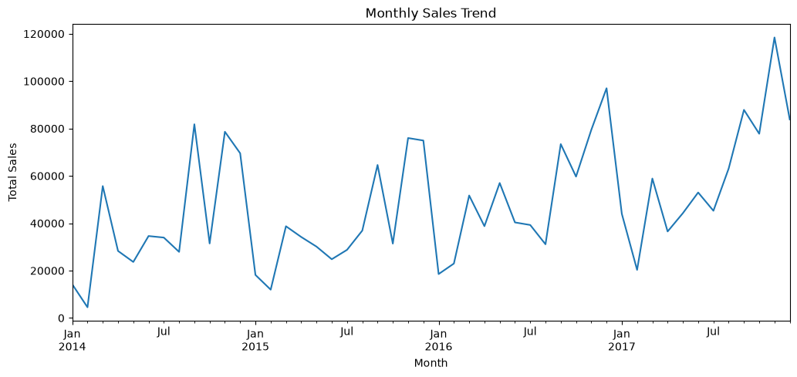
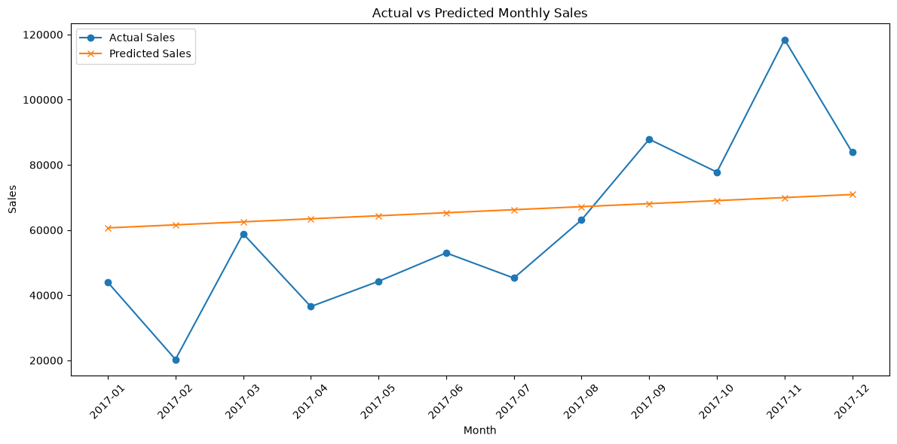
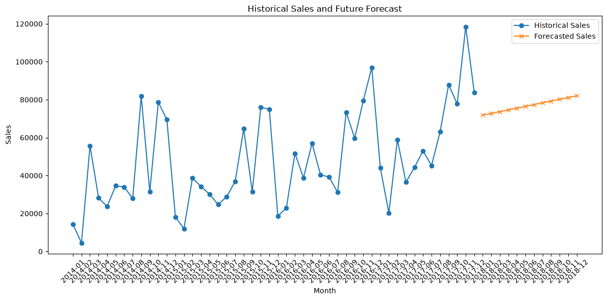

# FUTURE_ML_01 - Sales Forecasting using Machine Learning

## Project Overview

This project focuses on building a Machine Learning model to forecast future sales using historical business data.

Sales forecasting is an important business application that helps organizations make data-driven decisions related to inventory planning, revenue estimation, staffing, and resource management.

In this project, historical sales data from the Superstore dataset was analyzed, cleaned, transformed into time-based features, and used to develop a forecasting model. The project demonstrates the complete Machine Learning workflow from data preparation to future sales prediction and business interpretation.

---

## Objective

The objective of this project is to build a sales forecasting system that predicts future sales based on historical sales trends.

The project aims to demonstrate how Machine Learning can support real-world business planning by identifying patterns in historical data and generating future sales estimates.

---

## Dataset

**Dataset Used:** Superstore Sales Dataset

The dataset contains historical retail transaction information, including:

- Order Date
- Customer information
- Product categories
- Sales
- Quantity
- Discount
- Profit
- Region information

The dataset was used to analyze monthly sales trends and build a forecasting model.

---

## Technologies Used

- Python
- Jupyter Notebook
- Pandas
- NumPy
- Matplotlib
- Scikit-learn

---

## Project Workflow

The project follows these steps:

1. Data loading and exploration
2. Data cleaning and preprocessing
3. Conversion of date information into time-based features
4. Monthly sales aggregation
5. Exploratory data analysis and visualization
6. Train-test split for model evaluation
7. Machine Learning model training
8. Sales prediction
9. Model evaluation using error metrics
10. Future sales forecasting
11. Business interpretation of results

---

## Feature Engineering

Time-based features were created from the Order Date column to help analyze sales patterns over time.

Features created include:

- Year
- Month
- Month Name
- Month-Year
- Time index

Monthly sales aggregation was performed to prepare the dataset for forecasting.

---

## Machine Learning Model

A Linear Regression model was used as a baseline forecasting approach.

The model learns the relationship between time progression and historical monthly sales values to estimate future sales trends.

The forecasting workflow:

Historical Sales Data  
→ Time-Based Feature Engineering  
→ Linear Regression Model  
→ Future Sales Prediction

---

## Model Evaluation

The model was evaluated using:

### Mean Absolute Error (MAE)

MAE measures the average difference between actual sales values and predicted sales values.

### Root Mean Squared Error (RMSE)

RMSE measures prediction error while giving more importance to larger errors.

Model performance:

- MAE: 19663.55
- RMSE: 23664.50

The errors indicate that the model captures the overall sales trend but may not fully capture sudden sales spikes or complex seasonal patterns.

---

## Results and Visualizations

The project includes visualizations to help understand the forecasting results:

- Historical monthly sales trends
- Actual sales vs predicted sales comparison
- Future sales forecast visualization

The forecast provides an estimate of expected future sales based on patterns observed in historical business data.

### Historical Sales Trend



### Actual vs Predicted Sales



### Future Sales Forecast



---

## Business Value

Sales forecasting can help businesses:

- Plan inventory requirements
- Estimate future revenue
- Prepare staffing needs
- Improve budgeting decisions
- Reduce risks from overstocking or insufficient inventory

The forecast provides business managers with additional information to support data-driven planning decisions.

---

## Limitations and Future Improvements

This project uses Linear Regression as a baseline forecasting approach to identify general sales trends.

While the model captures overall patterns in historical sales data, sales can also be influenced by external factors such as promotions, holidays, seasonal changes, and customer behavior.

Future improvements could include:
- Applying advanced time-series forecasting methods such as ARIMA or Prophet
- Adding additional business-related features
- Comparing multiple machine learning models
- Developing interactive dashboards using Power BI or Tableau

---

## How to Run the Project

1. Clone this repository.

2. Install the required libraries:

```bash
pip install -r requirements.txt
```

3. Launch Jupyter Notebook:

```bash
jupyter notebook
```

4. Open the notebook located at:

```text
notebooks/Sales_Forecasting.ipynb
```

5. Run all cells to reproduce the analysis and generate the sales forecast results.

---

## Conclusion

This project demonstrates how Machine Learning can be applied to business forecasting problems.

By analyzing historical sales patterns and generating future predictions, the model provides insights that can support inventory management, financial planning, and business decision-making.

## Author

### **Tanya Balu**<br>
BE Computer Science <br>

This project was completed as part of the Machine Learning Internship at Future Interns. The task focused on building a sales forecasting model using historical business data, applying data preprocessing, time-based feature engineering, regression-based forecasting, model evaluation, and visualization techniques.
